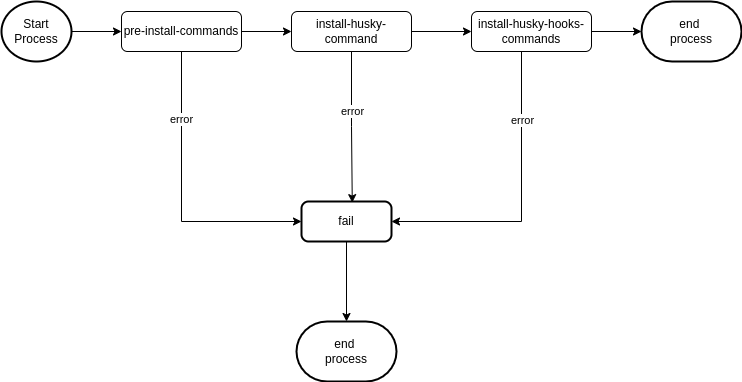

# Welcome to @husky-hook-creator/core 👋

### The library gonna help you to configure all your husky hooks


[](https://github.com/thiagoolsilva/husky-hook-creator#readme)
[](https://github.com/thiagoolsilva/husky-hook-creator/graphs/commit-activity)

### 🏠 [Homepage](https://github.com/thiagoolsilva/husky-hook-creator#readme)

# Table of Contents

1. [Prerequisites](#prerequisites)
1. [Install](#install)
1. [Getting Started](#getting-started)
1. [Features](#features)
   1. [Commands](#commands)
      1. [Pre install command](#pre-install-command)
      1. [Install Husky command](#install-husky-command)
      1. [Husky hooks command](#husky-hooks-command)
      1. [Run all command](#run-all-command)
   1. [Runner](#runner)
      1. [ShellJs Runner](#shell-js-runner)
      1. [custom Runner](#custom-runner)
1. [Local Development](#local-development)
   1. [Install Local Dependencies](#install-local-dependencies)
   1. [Run unit testing](#run-unit-testing)
   1. [Run coverage unit testing](#run-coverage-unit-testing)

## Prerequisites

- node >=14.0.0
- husky >=7.0.2

## Install

```sh
yarn add @husky-hook-creator/core
```

## Getting Started

This section will help you to install the library on a node project. The following steps use assume you have Node.js >= 14 and Yarn installed.

1. Create new Node Project

2. Inside your project run `yarn add @husky-hook-creator/core ts-node@10.3.0`

3. Create a new file called `husky-hooks.ts` and insert the following code

```sh
import { CommandHookFactory, HuskyRunnerFactory } from '@husky-hook-creator/core';

const huskyHook = HuskyRunnerFactory.createShellJsRunner();
await huskyHook
  .addPreInstallCommand('rm -rf .husky')
  .installHusky()
  .addCommand(CommandHookFactory.createHookCommand('pre-commit', 'echo this is a pre-commit hook.'))
  .addCommand(CommandHookFactory.createHookCommand('pre-push', 'echo this is a pre-push hook.'))
  .runAllCommands();
```

### (Optional) ts-node

The library ts-node gonna help us to run the typescript code executing and installing all git hooks from the library.

1. Install the ts-node executing the command `yarn add -D ts-node@10.3.0`
1. Execute the created script executing the command `ts-node yourPath/your-runner.ts`

For more details, please check the script named **create-hooks-with-custom-executor** at [package.json](https://github.com/thiagoolsilva/husky-hook-creator/blob/main/sample/package.json).

## Features

The husky library uses the concept of pipeline to run all commands in order as will be show below.



## Commands

All available commands are:

1. **pre-install-command** - Execute all commands before install husky library
1. **install-husky** - Install husky library
1. **husky-hooks** - Install git hooks using husky library
1. **run-all-commands** - Execute all commands

### Pre install command

Execute **all scripts commands** before install the husky library.

#### Syntax

`addPreInstallCommand(scriptCommand: string)`

#### Usage

1. From an instance of **HuskyRunner** use the method `addPreInstallCommand(scriptCommand: string)`
1. Call `runner.addPreInstallCommand('rm -rf library/.husky');` from class **HuskyRunner** to configure the command.

Full Example

```sh
import { CommandHookFactory, HuskyRunnerFactory } from '@husky-hook-creator/core';

const huskyHook = HuskyRunnerFactory.createShellJsRunner();
await huskyHook
  .addPreInstallCommand('rm -rf .husky')
  .addCommand(CommandHookFactory.createHookCommand('pre-push', 'echo this is a pre-push hook.'))
  .runAllCommands();
```

### Install Husky command

Execute the **script command** to install husky library.

#### Syntax

`installHusky(huskyInstallCommand?: string)`

#### Usage

1. From an instance of **HuskyRunner** use the method `installHusky(huskyInstallCommand?: string)`
1. Call `runner.installHusky();` from class **HuskyRunner** to install the library.

Full Example

```sh
import { CommandHookFactory, HuskyRunnerFactory } from '@husky-hook-creator/core';

const huskyHook = HuskyRunnerFactory.createShellJsRunner();
await huskyHook
  .installHusky()
  .addCommand(CommandHookFactory.createHookCommand('pre-push', 'echo this is a pre-push hook.'))
  .runAllCommands();
```

If you need to install husky library from a folder that does not contains any .git folder, please check the example in the [file](https://github.com/thiagoolsilva/husky-hook-creator/blob/main/library/script/src/create-hooks.ts).

### Husky hooks command

Execute all **git hooks commands**.

#### Syntax

`addCommand(command: CommandHookInterface)`

#### Usage

1. From an instance of **HuskyRunner** use the method `addCommand(command: CommandHookInterface)`
1. Call `runner.addCommand(command);` from class **HuskyRunner** to create new husky command.

Full Example

```sh
import { CommandHookFactory, HuskyRunnerFactory } from '@husky-hook-creator/core';

const huskyHook = HuskyRunnerFactory.createShellJsRunner();
await huskyHook
  .addCommand(CommandHookFactory.createHookCommand('pre-push', 'echo this is a pre-push hook.'))
  .runAllCommands();
```

Warning: You need to provide valid git hooks when creating new hooks. For more details go to <https://git-scm.com/book/en/v2/Customizing-Git-Git-Hooks>

### Run all command

Start core Runner hooks

#### Usage

1. From an instance of **HuskyRunner** use the method `runAllCommands())`
1. Call `runner.runAllCommands();` from class **HuskyRunner** to start husky hooks.

Full Example

```sh
import { CommandHookFactory, HuskyRunnerFactory } from '@husky-hook-creator/core';

const huskyHook = HuskyRunnerFactory.createShellJsRunner();
await huskyHook
  .addCommand(CommandHookFactory.createHookCommand('pre-push', 'echo this is a pre-push hook.'))
  .runAllCommands();
```

## Runner

All available Runner are:

1. **ShellJsExecutor** - Runner that uses shellJs to run all commands
1. **HuskyRunnerInterface** - Custom interface to provide your Runner

### Shell JS Runner

Default Runner to execute all husky hooks.

#### Usage

1. Import all required class `import { CommandHookFactory, HuskyRunnerFactory } from '@husky-hook-creator/core';`
1. Call the `HuskyRunnerFactory.createShellJsRunner()` to create new ShejjJSRunner

Full Example

```sh
import { CommandHookFactory, HuskyRunnerFactory } from '@husky-hook-creator/core';

const huskyHook = HuskyRunnerFactory.createShellJsRunner();
await huskyHook
  .addCommand(CommandHookFactory.createHookCommand('pre-push', 'echo this is a pre-push hook.'))
  .runAllCommands();
```

### Custom Runner

The library provides the interface `ExecutorInterface.ts` that help us to create a custom Runner.

#### Usage

1. Create new file that implements the interface `ExecutorInterface.ts`
1. Call Runner Factory `HuskyRunnerFactory.createCustomRunner(runner:ExecutorInterface);`
1. Execute your husky hooks

Full Example:

##### File: custom-executor.ts

```sh
import { ExecutorInterface } from '@husky-hook-creator/core';
import execa from 'execa';

export class CustomExecutor implements ExecutorInterface {
  public async exec(command: string): Promise<void> {
    const resultCommand = await execa(command, undefined, {
      shell: true,
    });
    console.log(resultCommand.stdout);
  }
}
```

##### File: husky-custom-runner.ts

```sh
import { CommandHookFactory, HuskyRunnerFactory } from '@husky-hook-creator/core';
import { CustomExecutor } from './custom-executor/execa-executor';

// For more details about git hooks go to https://git-scm.com/book/en/v2/Customizing-Git-Git-Hooks
(async () => {
  const huskyHook = HuskyRunnerFactory.createCustomRunner(new CustomExecutor());
  await huskyHook
    .addPreInstallCommand('rm -rf .husky')
    .installHusky('cd .. && husky install sample/.husky')
    .addCommand(
      CommandHookFactory.createHookCommand('pre-commit', 'echo your second shell script goes here.'),
    )
    .runAllCommands();
})();
```

## Local Development

In order to create new local features you need to follow some steps as will be shown below.

### install-local-dependencies

To install all library dependencies you should execute the follow command.

```sh
cd library && yarn
```

### Run unit testing

To execute all unit testing you should execute the follow command.

```sh
cd library && yarn test:unit-testing
```

### Run coverage unit testing

To execute all coverage unit testing you should execute the follow command.

```sh
cd library && yarn test:unit-testing:coverage
```

## Author

👤 **thiago lopes da silva <thiagoolsilva@gmail.com>, kaio monteiro calás da costa <kaiomonteiro151@gmail.com>**

- Website: <https://medium.com/@thiagolopessilva>
- Github: [@thiagoolsilva](https://github.com/thiagoolsilva)
- LinkedIn: [@thiago-lopes-silva-2b943a25](https://linkedin.com/in/thiago-lopes-silva-2b943a25)

## Code of Conduct

Feel free to check the [code of conduct guide](https://github.com/thiagoolsilva/husky-starter/blob/main/CODE_OF_CONDUCT.md).

## Contributing

Contributions, issues and feature requests are welcome!

Feel free to check [issues page](https://github.com/thiagoolsilva/husky-starter/issues). You can also take a look at the [contributing guide](https://github.com/thiagoolsilva/husky-starter/blob/main/CONTRIBUTING.md).

## Show your support

Give a ⭐️ if this project helped you!

## 📝 License

Copyright © 2022 [thiago lopes da silva <thiagoolsilva@gmail.com>, kaio monteiro calás da costa <kaiomonteiro151@gmail.com>](https://github.com/thiagoolsilva).

This project is [Apache License 2.0](https://github.com/thiagoolsilva/husky-starter/blob/main/LICENSE) licensed.

---

_This README was generated with ❤️ by [readme-md-generator](https://github.com/kefranabg/readme-md-generator)_
